## Description

This is a wordpress plugin that extends standard woocommerce import products functionality and lets you import, not only from a local file, but also from your google sheet file which you store on your google drive and can be edited by any member of your store team.

Standard woocommerce import, that was introduced by woocommerce team since version 3.1, became a greater plugin feature that lets you not use additional plugins and extensions for product import processes. However, if it’s a pain every time when you’re loading csv import files from your local machine, then this file is a great choice that lets you not to do it anymore. Just set your google sheet name that you store on your google drive once and in the future you will only have to press the button "Import" as usual. Plugin itself will pull the new data from the specified google sheet table.

## Installation
It's a recommended to use the [official plugin page on WordPress.org](https://wordpress.org/plugins/import-products-from-gsheet-for-woo-importer/).

Also as option you can directly install plugin from github repository.
1. Clone repository to the `/wp-content/plugins/` directory.
2. Activate the plugin through the 'Plugins' menu in WordPress.

## Set plugin options

After plugin installation we need to set connection with google API. In a plugin settings you have two options to set google API connection.
1. "One Click Auto Connect" method with google auth code ( more simple and straightforward connection method ).
2. "Manual Connect" method with assertion client_secret json code.

You need to set connection once and in the feature you can process import woocommerce product with your google sheet file every time you need.

### 1 method. "One Click Auto Connect" with google auth code (!!! Please note since google change his connection api, first method  temporary not working, please use second method with "Manual Connect" !!!)

This method is recomended and default in plugin settings area. Follow the steps to set it.

1. Go to plugin setting and press "Get Code" button in "One Click Auto Connect" tab 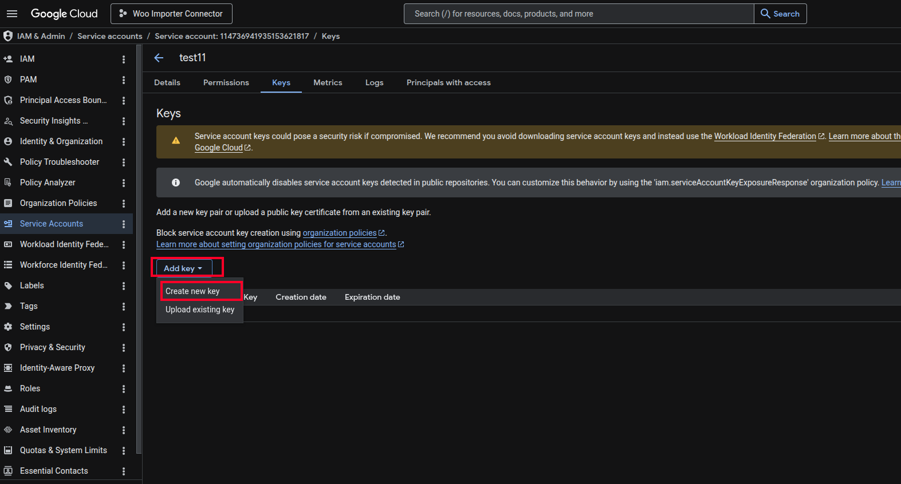

2. You will be redirected with new tab in plugin application page on a google service. Please choose google account where you store your google sheet import file on google drive 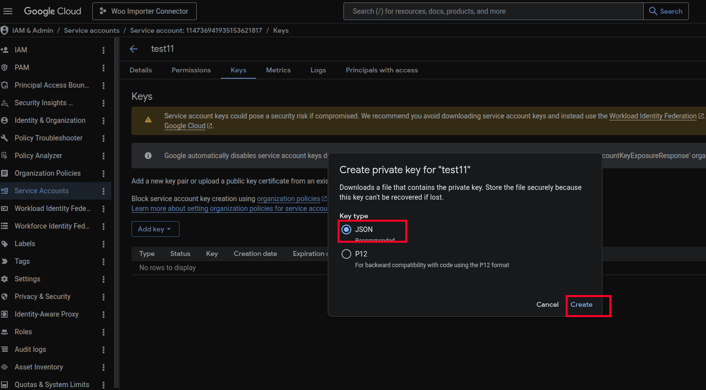

3. In the next page you need provide access "See and download all your Google Drive files." with plugin application. Please check corresponding checkbox and press continue button 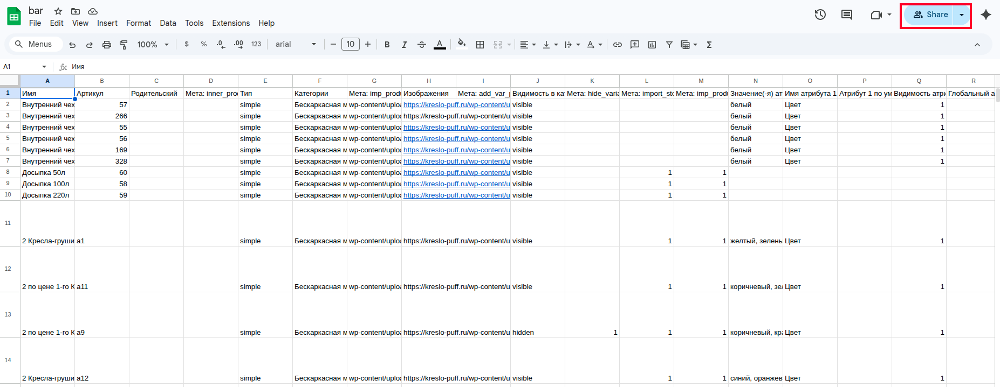

4. In the last page you received google auth code. Please copy this code.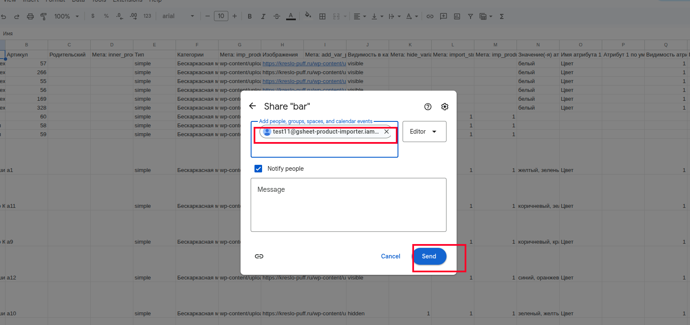

5. After you received code, please return to plugin setting page, paste it to corresponding input and press "Save Options" button.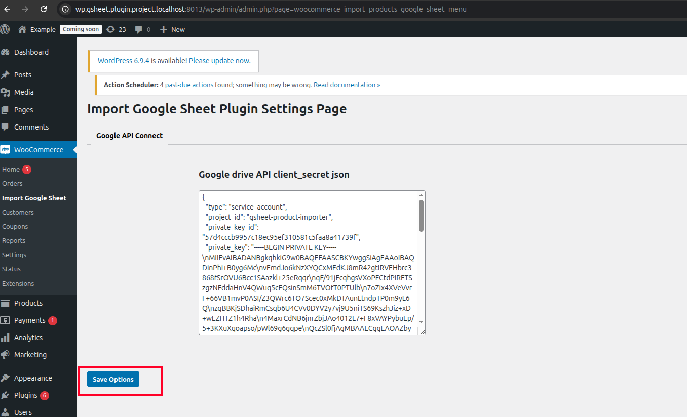

6. If code valid you will see corresponding message and new select for google sheet title and then you must to choose google sheet title that become your import file 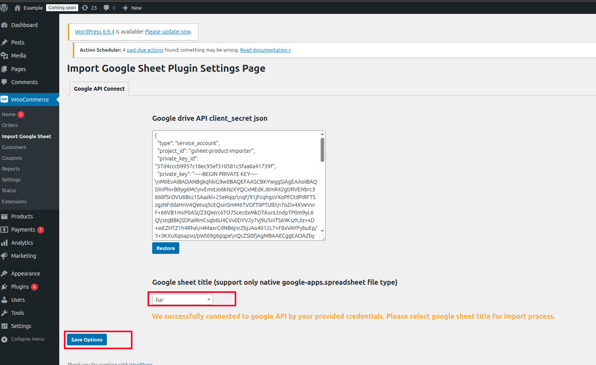 Sheet title you can find in upper left corner of your sheet on google drive 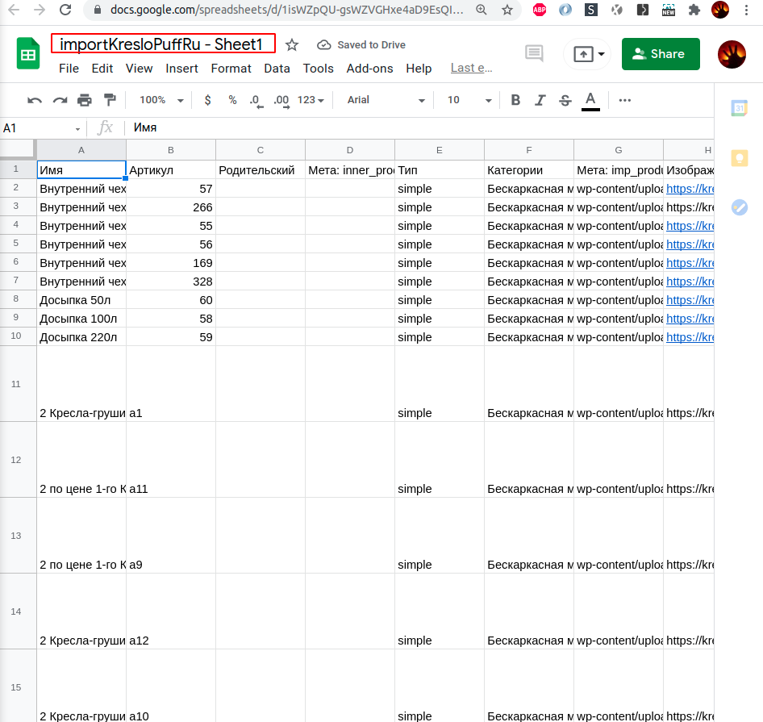 

7. That all. If you set all settings properly you will receive success connection message with link to standard woocommerce import page where you can process import products with your google sheet file 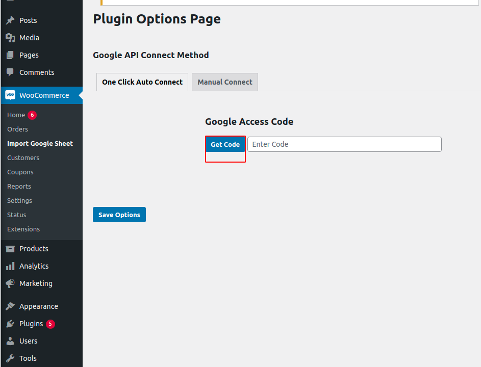

### 2 method. "Manual Connect" with assertion client_secret json code.

1. If you do not have a google API client_secret json code than go to [google cloud console page.](https://console.developers.google.com) where you can create new one (if you have than you can go to step 13)

2. Go to [API Library page ](https://console.cloud.google.com/apis/library) and in the search input type "Google Drive API" 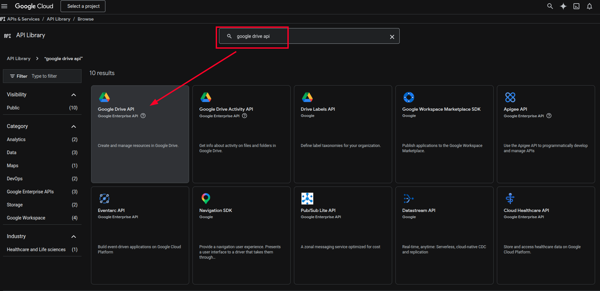 

3. Click on a first search result and enable "Google Drive API" 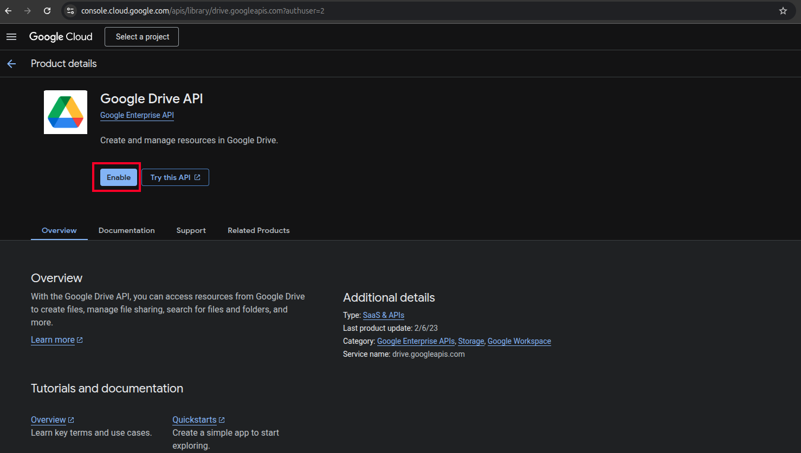

4. Then you can create new credentials.  Just click button "Create Сredentials" 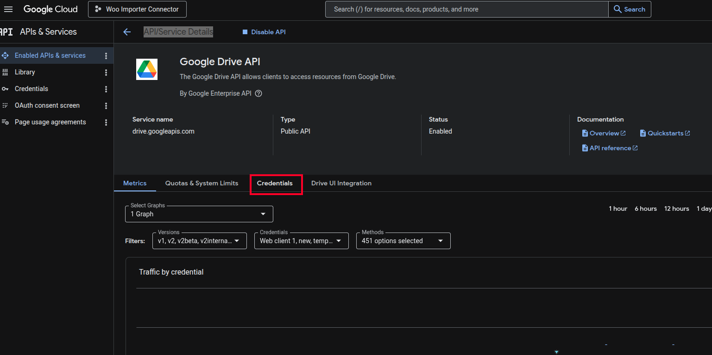

5. In the next page, the system  will ask you to fill the form with data for your credentials, please fill it in the same way as you can see on the screenshot below 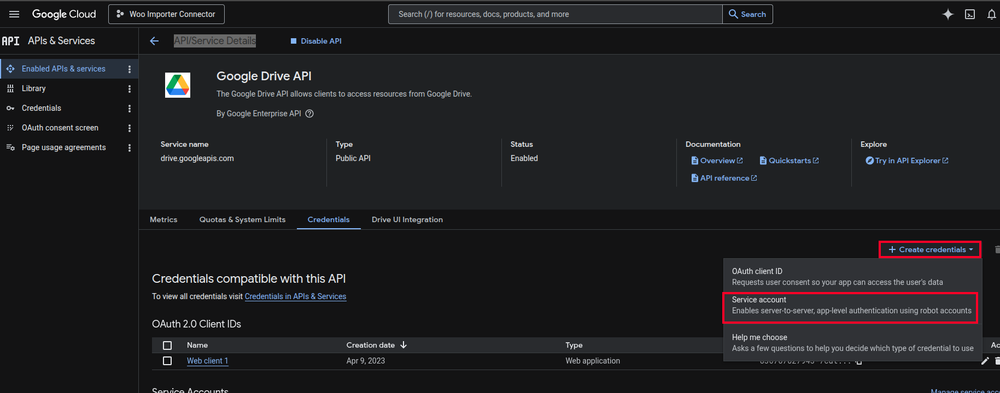

6. In the next step you will be redirected to 'Create service account' page and you will see the form for it, feel free to choose any service account name in the appropriate field and select role project -> editor, than skip "Grant users access to this service account" and press "Done" button. 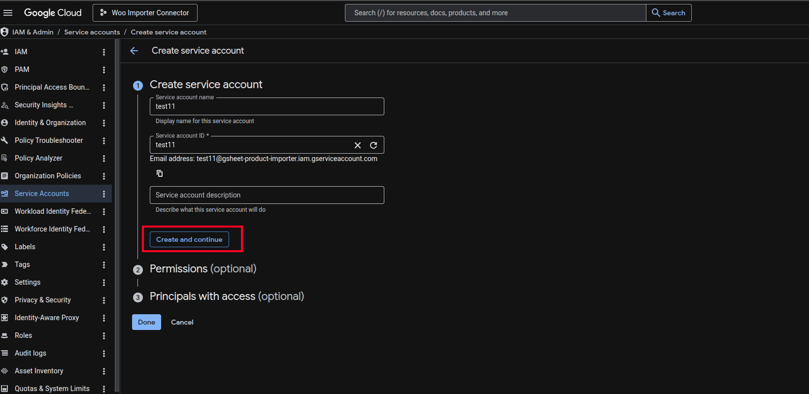 After it you should have a newly created service account.

7. Then you can go to your [credentials page](https://console.cloud.google.com/apis/credentials) find your newly created 'Service Account' click on it 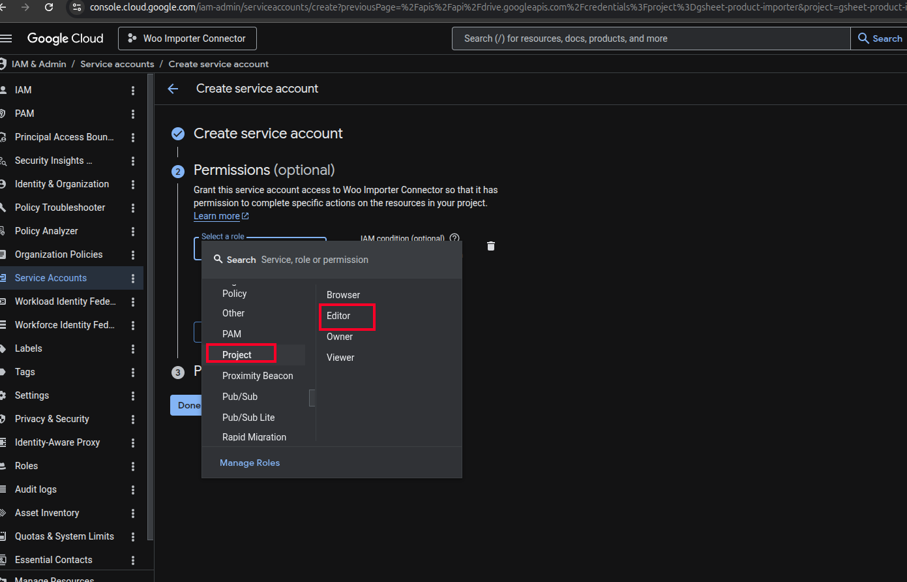

8. Then find the key tab and create a new key client_secret for your service account with json format. 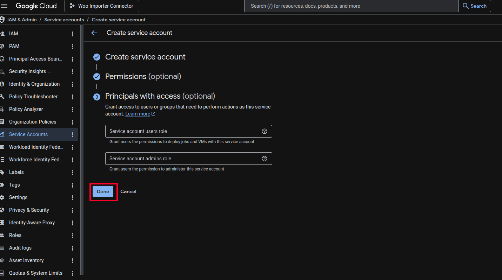

9. Please find client_email in client_secret json and copy it to your buffer for the next step.

10. Open your google sheet import file on your google drive and share access to it with client_email that you copy to buffer in previous step 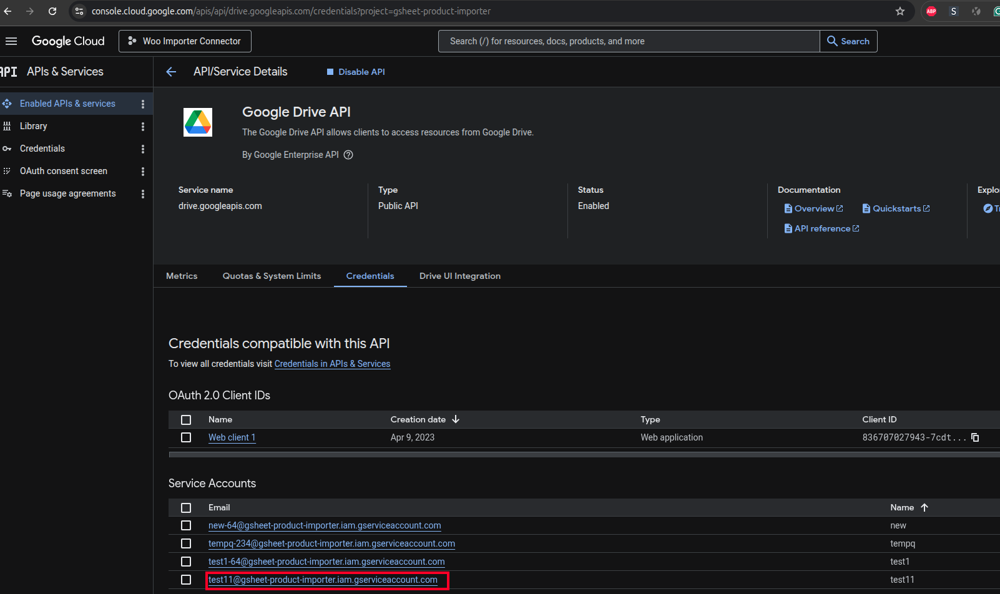

11. Please copy the client_secret json key (all file content file) to appropriate input in the option plugin page and save it. 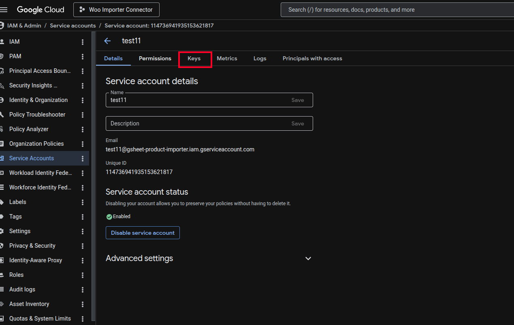

12. After it, you should see select with google sheets list for your import, pick one of them and press 'Save Options'. 

That’s all, if you set valid data you will see a success message, and when you next time try to import woocommerce product you will see an additional button that gives you the opportunity to import product from google sheet. 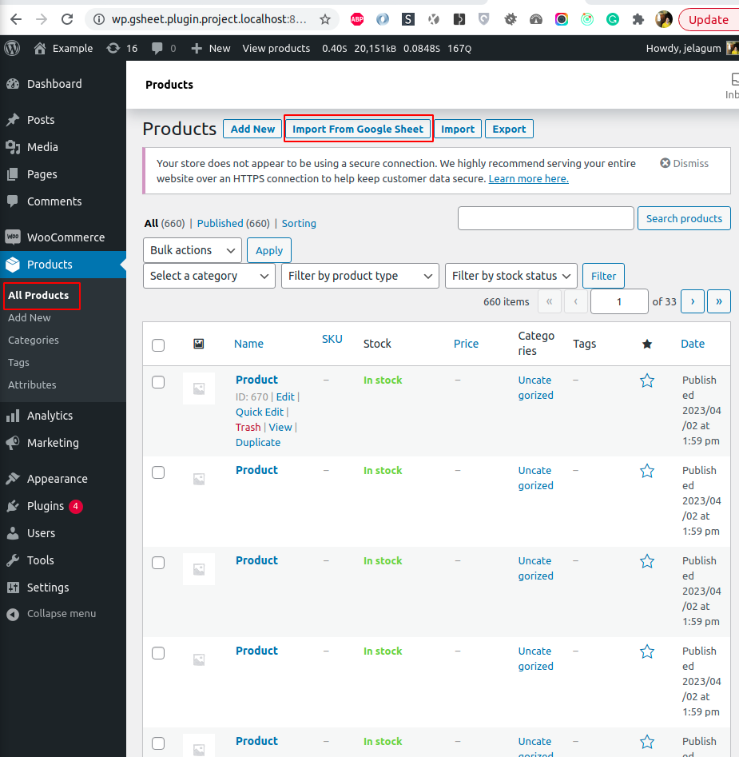
