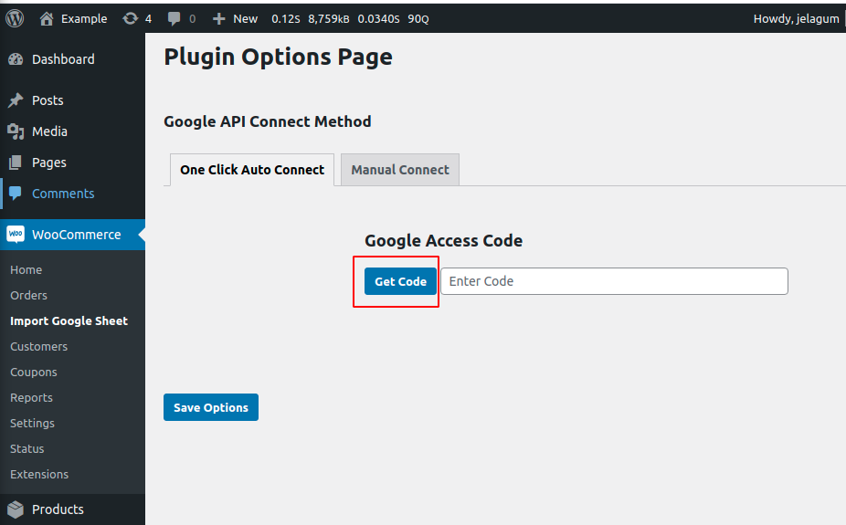
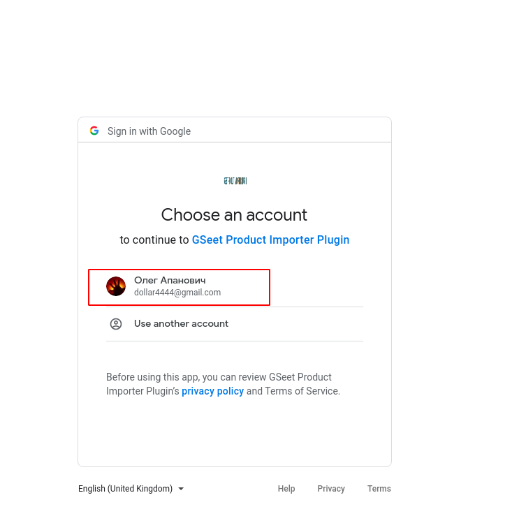
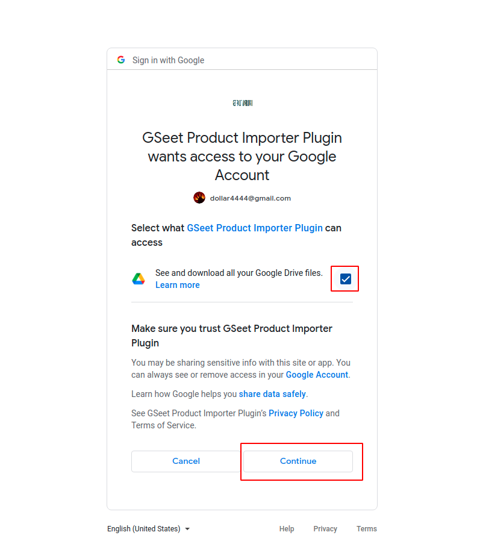
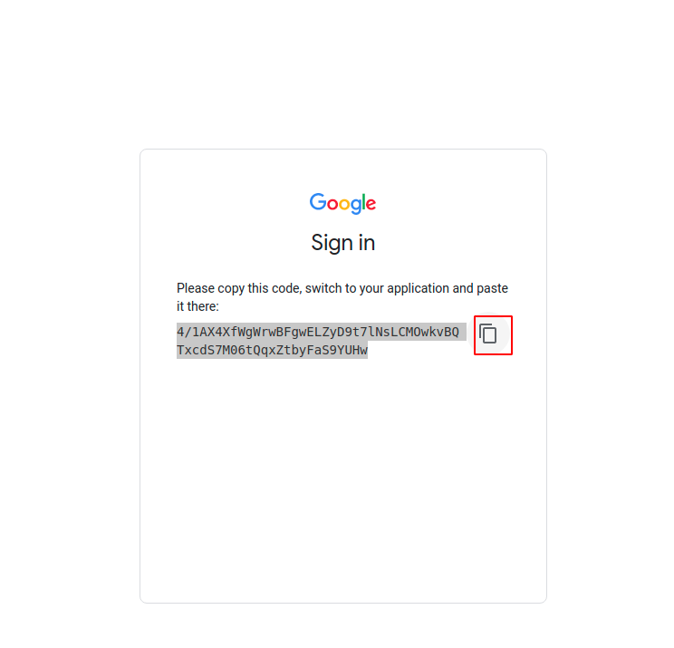
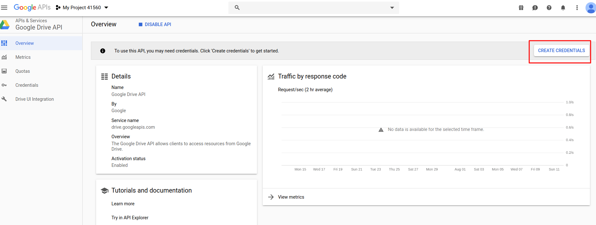
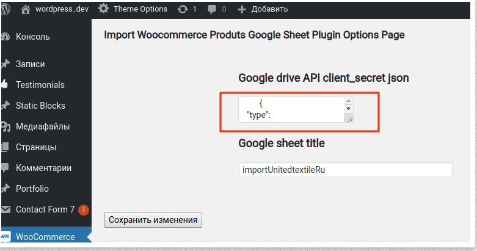
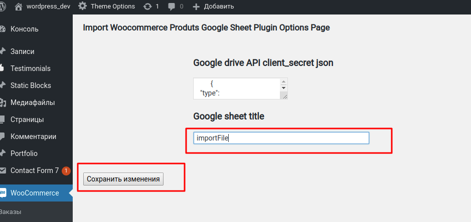

## Description

This is a wordpress plugin that extends standard woocommerce import products functionality and lets you import, not only from a local file, but also from your google sheet file which you store on your google drive and can be edited by any member of your store team.

Standard woocommerce import, that was introduced by woocommerce team since version 3.1, became a greater plugin feature that lets you not use additional plugins and extensions for product import processes. However, if it’s a pain every time when you’re loading csv import files from your local machine, then this file is a great choice that lets you not to do it anymore. Just set your google sheet name that you store on your google drive once and in the future you will only have to press the button "Import" as usual. Plugin itself will pull the new data from the specified google sheet table.

## Installation
It's a recommended to use the [official plugin page on WordPress.org](https://wordpress.org/plugins/import-products-from-gsheet-for-woo-importer/).

Also as option you can directly install plugin from github repository.
1. Clone repository to the `/wp-content/plugins/` directory.
2. Activate the plugin through the 'Plugins' menu in WordPress.

## Set plugin options

After plugin installation we need to set connection with google API. In a plugin settings you have two options to set google API connection.
1. "One Click Auto Connect" method with google auth code ( more simple and straightforward connection method ).
2. "Manual Connect" method with assertion client_secret json code.

You need to set connection once and in the feature you can process import woocommerce product with your google sheet file every time you need.

### 1 method. "One Click Auto Connect" with google auth code (!!! Please note since google change his connection api, first method  temporary not working, please use second method with "Manual Connect" !!!)

This method is recomended and default in plugin settings area. Follow the steps to set it.

1. Go to plugin setting and press "Get Code" button in "One Click Auto Connect" tab 

2. You will be redirected with new tab in plugin application page on a google service. Please choose google account where you store your google sheet import file on google drive 

3. In the next page you need provide access "See and download all your Google Drive files." with plugin application. Please check corresponding checkbox and press continue button 

4. In the last page you received google auth code. Please copy this code.

5. After you received code, please return to plugin setting page, paste it to corresponding input and press "Save Options" button.

6. If code valid you will see corresponding message and new select for google sheet title and then you must to choose google sheet title that become your import file  Sheet title you can find in upper left corner of your sheet on google drive  

7. That all. If you set all settings properly you will receive success connection message with link to standard woocommerce import page where you can process import products with your google sheet file 

### 2 method. "Manual Connect" with assertion client_secret json code.

1. Set your standard woocommerce import file to google drive.

2. Go to [google cloud console page.](https://console.developers.google.com)

3. In the search input type "google drive" and click on the first tip "Google Drive API" 

4. If it is your first project in google developer console and you have never created a project before, then the system will ask you to create a new one, click button "Create" 

5. Then you will be redirected to the project settings page, for our needs, there will be enough standard project options and you can just click button "Create" on this page 

6. In the next page, the system will ask you to enable google drive api for your new project, then just press button "Enable" 

7. Then you will be redirected to the main google drive api info page where you can create new credentials if you have not created them before.  Just click button "Create Сredentials" 

8. In the next page, the system  will ask you to fill the form out with data for your credentials, please fill it in the same way as you can see on the screenshot below and press the button "What credentials do I need" 

9. In the next page you will see the next form for your credentials, feel free to choose any service account name in the appropriate field and select role project -> editor, key button type leave default json and press button "Continue" 

10. After that, the system will offer you to download the api key json file. Save it on your local machine and then you can close google developer console browser tab.

11. Please copy the client_secret json key (all file content) that you have received in the previous step to appropriate input in option plugin page 

12. Please find client_email in client_secret json and copy it to your buffer for the next step.

13. Open your google sheet file that you set to your google drive in step 1 and share access to it with client_email email that you copy to buffer in previous step 

14. Then copy the name of the google sheet file to appropriate plugin setting field "Google sheet title" and press the submit button. 

That’s all, if you set valid data you will see a success message, and when you next time try to import woocommerce product you will see an additional button that gives you the opportunity to import product from google sheet. 
