## Description

This is a wordpress plugin that extends standard woocommerce import products functionality and lets you import, not only from a local file, but also from your google sheet file, which you store on your google drive and can be edited by any member of your store team.

Standard woocommerce import, which was introduced by woocommerce team since version 3.1, became a greater plugin feature that lets you not use additional plugins and extensions for product import processes. However, if it’s a pain every time when you’re loading csv import files from your local machine, then this plugin is a great choice that lets you not do it anymore. Just set it once, and in the future you will only have to press the button "Import" as usual. The plugin itself will pull the new data from the specified google sheet table.

## Installation
It's recommended to use the [official plugin page on WordPress.org](https://wordpress.org/plugins/import-products-from-gsheet-for-woo-importer/).

Also, as an option, you can directly install the plugin from github repository.
1. Clone the repository to the `/wp-content/plugins/` directory.
2. Activate the plugin through the 'Plugins' menu in WordPress.

## Set plugin options

After plugin installation, we need to set a connection with the Google API. In the plugin settings, you have to set the Google Drive API client_secret json.

You need to set the connection once, and in the future you can process import woocommerce products with your google sheet file every time you need.

### Set connection wtih client_secret json code.

1. If you already have Google API client_secret json code, then go to step 11, if not, go to step 2.

2. Go to [API Library page ](https://console.cloud.google.com/apis/library) and in the search input type "Google Drive API"
  
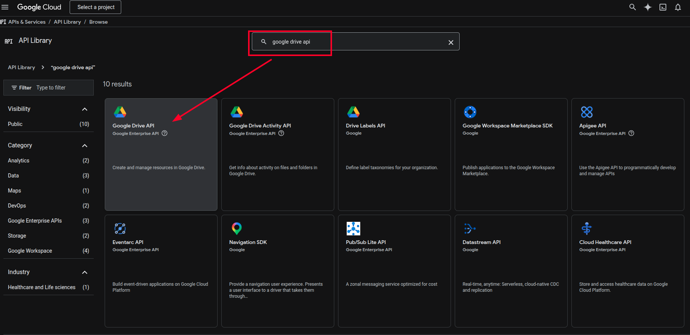 

5. Click on the first search result, and if you haven't enabled it before, you will see the "Enable' button, if it was already enabled before, you should see the "Manage' button. Clieck 'Manage' or 'Enable' button.

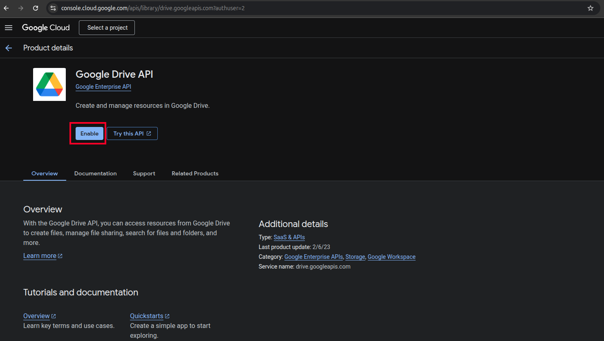

7. Then you will be redirected to the 'API/Service Details' page, where you can manage your drive api. Click the tab 'Credentials' there.

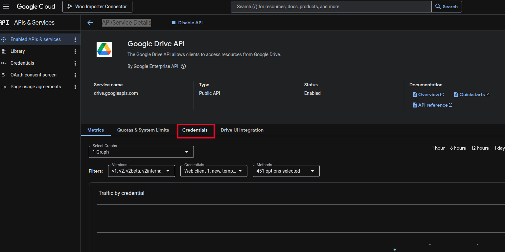

9. On the 'Credentials' tab, click the 'Create Credentials' button and pick the 'Service account' option in the drop-down menu.

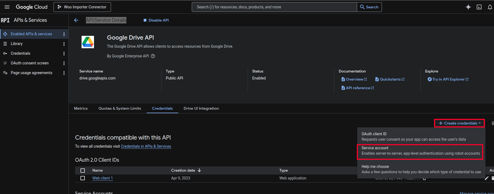

11. In the next step, you will be redirected to 'Create service account' page. Feel free to choose any service account name and ID in the appropriate fields. Then click the 'Create and continue' button.

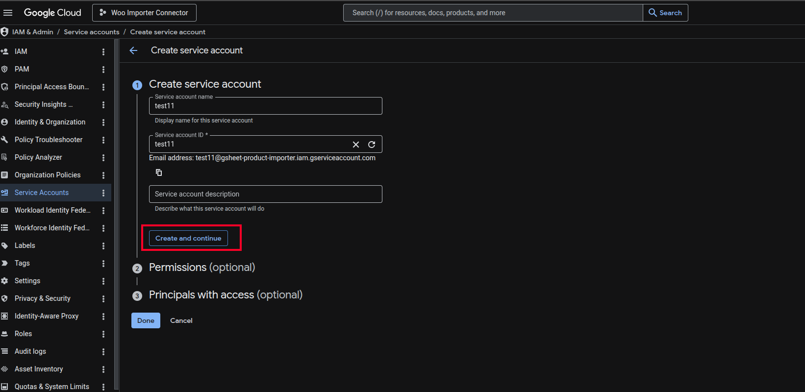

13. Then, on the 'Permissions' step, select role project -> editor and press the "Continue" button.

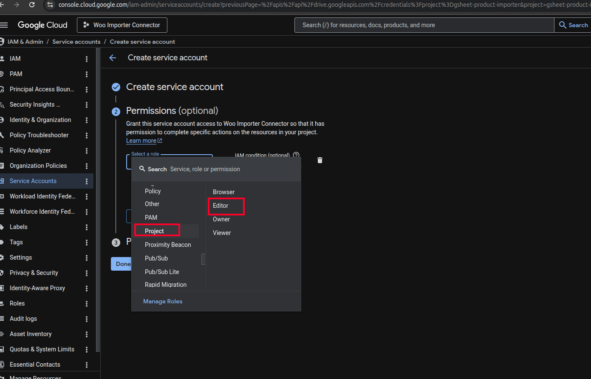

15. Then, on a 'Principals with access' click step, just click the 'Done' button.

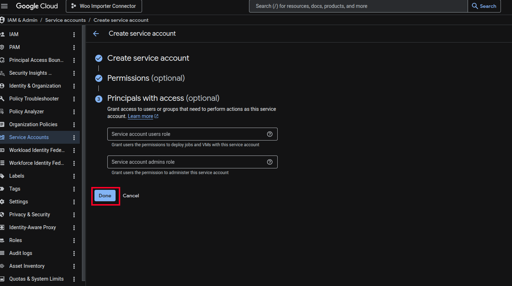

17. Then you will be redirected to [credentials page](https://console.cloud.google.com/apis/credentials) page, where you can find your newly created 'Service Account' in the list, click on it.
   
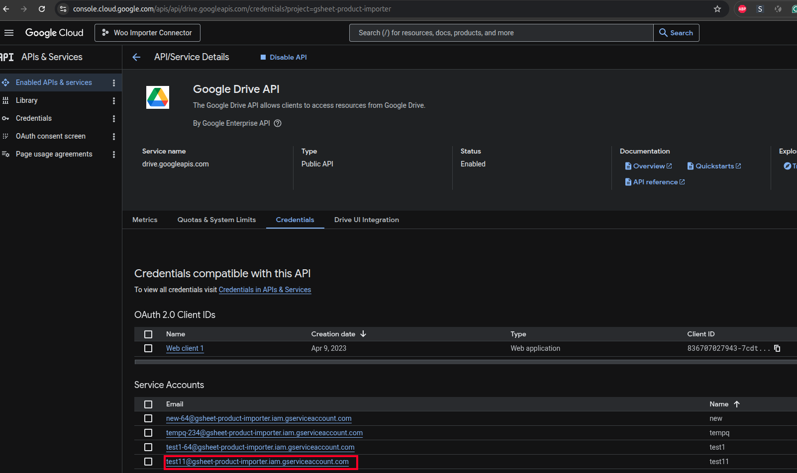

20. Then, on your service account page, click the 'Keys' tab.

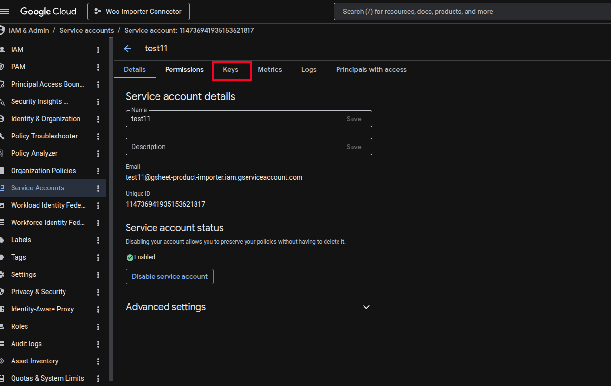

22. Then, on the 'Keys' tab click the 'Add key' button and pick the 'Create new key' option in the drop-down menu.

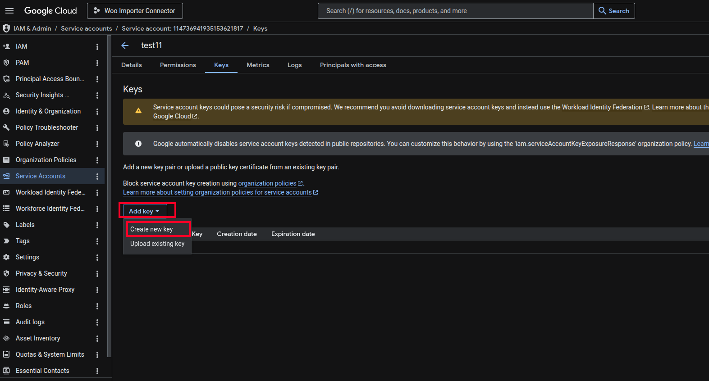

24. On the next step, pick JSON and the 'Create' button in the modal.

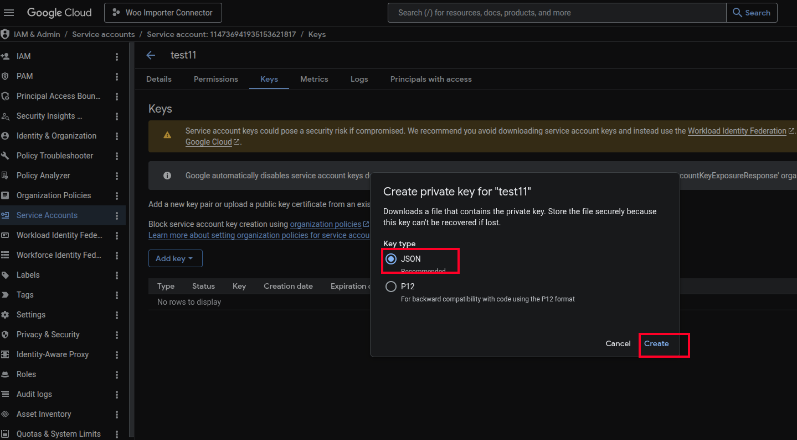

26. Download json file to your computer and open it with any text editor.

27. In the json find 'client_email' it should looks something like it 'test11@gsheet-product-importer.iam.gserviceaccount.com'. Copy it for the next step

28. On your [google drive page](https://drive.google.com/drive/my-drive) open google sheet import file that you will use. Remember that import supports only native google-apps.spreadsheet file type.

29. Click the button 'Share' for your google sheet file.

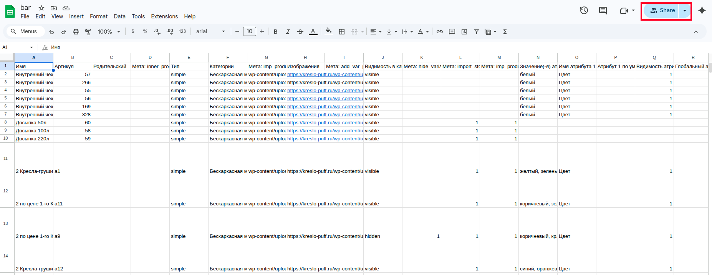

31. Paste your email there that you copied in step 15 and press the 'Send' button.

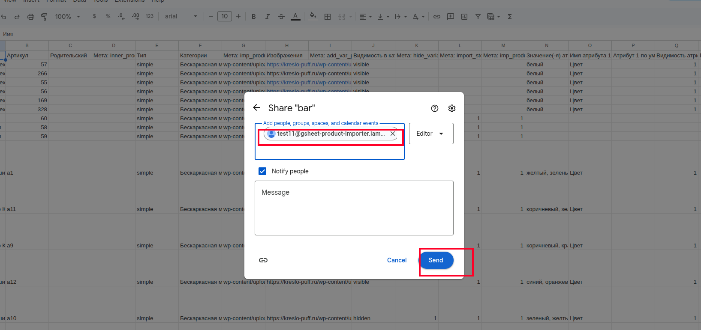

33. Right now, go to the plugin settings page in your wordpress dashboard and paste the client_secret json key (all file content that you obtained in step 14) to the appropriate input and press the 'Save' button.

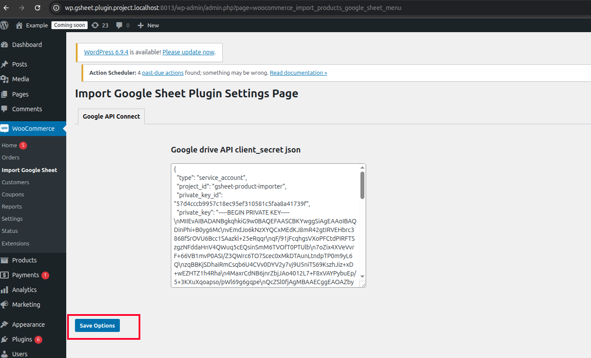

35. After it, you should see select with google sheets list for your import, pick one of them, and press the 'Save Options' button again.

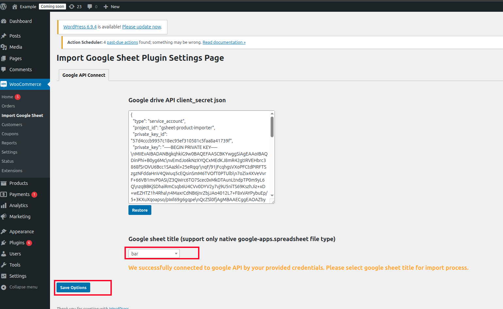

That’s all, if you set valid data, you will see a success message, and when you next time try to import woocommerce product you will see an additional button that gives you the opportunity to import a product from google sheet. 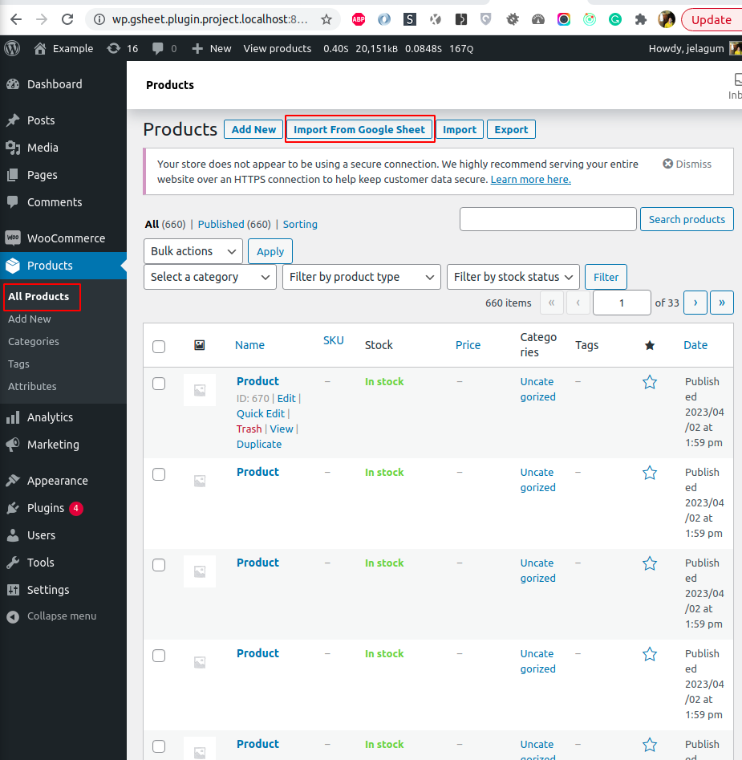
